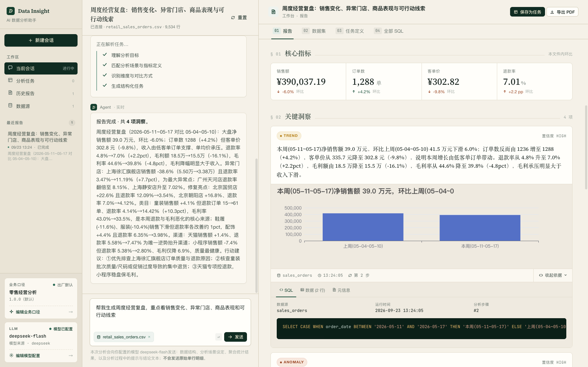

# Data Insight Agent

[](LICENSE)

**自部署的 AI 经营分析助手。** 上传一份 CSV / Excel 表格，用一句话说出你想看什么，它会生成一份**每条结论都能核对**的经营诊断报告：每条结论都附带它依据的 SQL、数据源和运行时间。

[English →](README.md)



<sub>图为内置零售样例数据的分析报告，由 OpenAI 兼容模型生成。</sub>

## 为什么用它

- **产出可核对的报告，而不是聊天回复**：每条结论关联 SQL、数据源与运行时间；指标变化由系统计算，不由模型编写。报告可导出 PDF。
- **跑在你自己的机器上**：单个 Docker 容器，数据只在你这里，没有任何第三方托管或看到。
- **用你自己的 AI 模型**：任何 OpenAI 兼容接口都可以——OpenAI、DeepSeek、通义千问（DashScope）、Kimi、智谱 GLM、Gemini、OpenRouter，或本地的 Ollama / vLLM。
- **可编辑的业务口径**：分析建立在行业知识包之上——指标口径、字段别名、异常阈值——都能在界面里调整。零售经营分析是首个内置行业包。

## 它能做什么

- **分析一份表格**：上传 CSV / `.xlsx`（或一键载入内置零售样例），说出分析目标，确认系统解析出的结构化任务，得到一份带核心指标、关键洞察、图表和下一步建议的报告。
- **下一期直接重跑**：把报告保存为分析任务，下一期上传同结构的新文件即可重跑，新报告自带「对比上期」段落。结构不一致的文件会在运行前被拦下，并列出缺少 / 多出的字段。
- **修改业务口径**：调整指标口径、字段别名与异常阈值，保存前有服务端校验，可一键恢复默认；每份报告都记录生成时使用的口径版本。
- **留存历史**：历史报告与数据源随时可查；每份报告都可以投「有用 / 没用」并补一句话，反馈只保存在你的本地数据库。

## 快速开始

需要 [Docker Desktop](https://www.docker.com/products/docker-desktop/)（或带 Compose v2 的 Docker Engine）。

```bash
git clone https://github.com/KoreyKing/data-insight-agent.git
cd data-insight-agent
docker compose up -d
```

打开 <http://localhost:8000>。首次启动会从 ghcr 拉取预构建镜像（amd64 / arm64），稍候即可。

**不配置模型也能先试用**：点击「使用零售样例」，即可用体验模式跑通完整流程——在内置数据上生成一份确定性的报告，不调用任何模型。

## 配置你自己的 AI 模型

要分析自己的数据，需要配置一个 OpenAI 兼容的模型接口：

- **界面配置（推荐）**：侧边栏 → 模型配置。选择服务商预设或填写接口地址，测试连接后保存。密钥保存在 `data/llm_config.json`（文件权限 `600`），响应中脱敏展示，不写入日志与报告。界面配置优先于 `.env`。
- **通过 `.env` 配置**：

```bash
cp .env.example .env
#   LLM_PROVIDER  服务商预设（openai / deepseek / dashscope / kimi / zhipu /
#                 gemini / openrouter / ollama / vllm），或 custom
#   LLM_BASE_URL  接口地址（custom 必填，用预设时可不填）
#   LLM_API_KEY   你的密钥
#   LLM_MODEL     模型名
docker compose up -d --force-recreate   # 重建容器使配置生效
```

请选择能稳定遵循 JSON 指令的模型；参数量很小的模型容易让分析循环中断。

## 用你自己的数据

- **格式**：首行为表头的普通二维表——CSV（UTF-8）或 `.xlsx`（可在界面选择工作表）。暂不支持合并单元格、多行表头和透视表。
- **字段**：每行一条订单明细。**必需**订单日期与净销售额两列；门店、商品类目、渠道用于下钻；订单编号、订单状态、退款金额、单位成本分别让订单数、退款率与毛利计算更准确。
- **列名识别**：按别名匹配，例如「订单日期」/ `date`、「门店」/ `store`、「销售额」/ `net_sales`。某一列没被识别时，在「业务口径设置」里把你的表头加为该字段的别名即可。
- **订单状态**：如果有这一列，取值须为 `completed`、`partial_refund`、`refunded`；没有这一列时，所有行都按已完成订单计算。

## 数据与隐私

- 数据都留在你的机器上：报告、数据集与配置存放在 `./data`（一个 SQLite 文件加上传的文件）。
- 配置了远程模型时，数据结构、聚合查询结果与提示文本会发送给**你所选择的模型服务商**；原始单行明细不会发送。
- 体验模式不调用任何模型。网页界面会从 Google Fonts 加载字体；除此之外，应用不连接任何第三方。

## 安全提示

- 应用**没有登录与用户管理**。任何能访问 8000 端口的人都能查看你的报告、修改模型配置。
- `docker-compose.yml` 默认在所有网卡上开放 8000 端口。只在本机使用时，把端口映射改为 `"127.0.0.1:8000:8000"`；不要在没有带认证的反向代理的情况下把它暴露到公网。

## 升级与备份

```bash
docker compose pull
docker compose up -d
```

启动时会自动升级数据库结构（只新增表与列，保留已有数据）。升级前请先备份 `./data` 目录。

## 当前限制

- 只支持一种数据模型：内置零售行业包所描述的单张销售明细表。
- 报告按需生成，暂不支持定时运行与推送。
- 界面以中文为主。
- 模型写出的分析文字可能以偏概全；数字都可复算，据结论行动前请用附带的 SQL 核对。
- 单用户、无访问控制（见[安全提示](#安全提示)）。

## 路线图

- 周期任务定时运行，邮件 / Webhook / IM 卡片推送
- MySQL / PostgreSQL 只读直连
- `uvx` 单命令本地运行；英文界面
- 第二个行业包：SaaS 运营

## 常见问题

- **打开 8000 是空白或连不上**：确认 `docker compose up -d` 已成功、容器在运行；首次启动需要时间拉取镜像。
- **提示未配置模型**：未配置模型时只能跑内置样例（体验模式）；要分析自己的文件，请按上文配置模型。
- **连不上同一台机器上的 Ollama / vLLM**：在 Docker 容器里，`localhost` 指的是容器自己。请用自定义接口地址，例如 `http://host.docker.internal:11434/v1`（Docker Desktop；Linux 上需要在服务里加 `extra_hosts: ["host.docker.internal:host-gateway"]`）。
- **上传失败或提示缺少字段**：见[用你自己的数据](#用你自己的数据)。

## 本地开发

需要 Python 3.11+、Node 22.13+、`uv` 与 `pnpm`（版本由 `frontend/package.json` 的 `packageManager` 锁定）。

```bash
make dev     # 同时启动前后端（Vite 在 http://localhost:5173，/api 代理到 :8000）
make check   # 后端 lint + 测试，前端类型检查 + lint + 测试 + 构建
make smoke   # 从源码构建 Docker 镜像并启动，检查 /health 与 /
make eval    # 报告质量评估：用你配置的模型，在隔离临时库里运行
```

- **架构与接口契约**：[docs/architecture.md](docs/architecture.md)。三层结构：确定性 workflow 外壳（数据连接、报告组装；调度与推送在规划中）、有界 agentic 分析内核（固定工具集、硬迭代上限、每条 SQL 都经校验）、行业知识包。
- **工程约定**（AI 编码助手同样会读取）：[CLAUDE.md](CLAUDE.md) / [AGENTS.md](AGENTS.md)。
- **反馈**：问题与建议请提 GitHub Issue。本仓库由维护者从工作仓同步发布，提交 PR 前请先开 Issue 讨论。

## License

[MIT](LICENSE)
